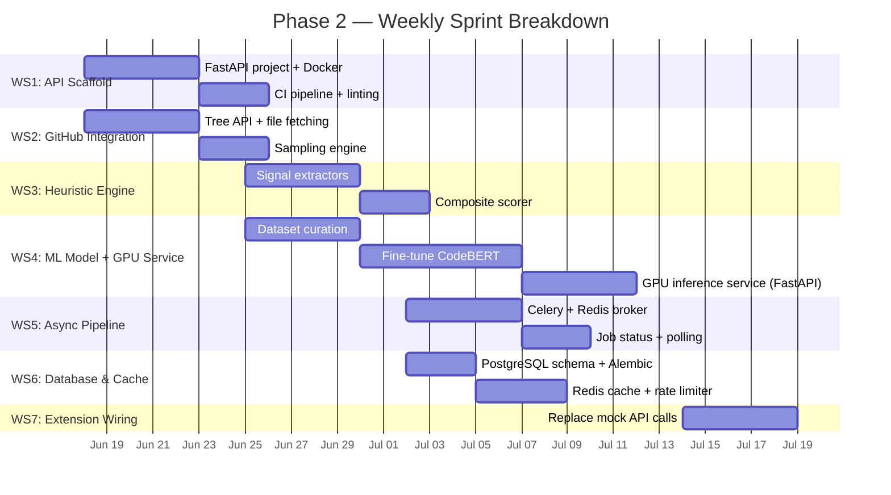
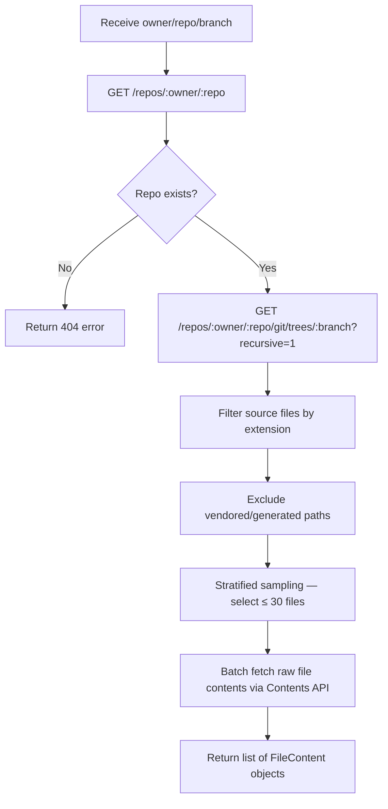
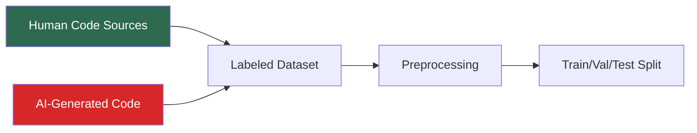
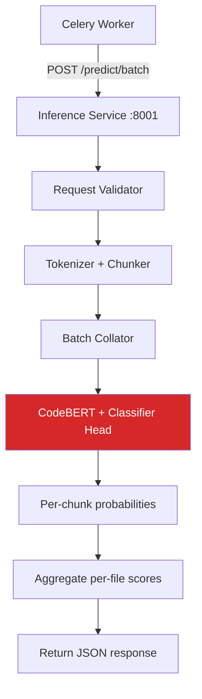
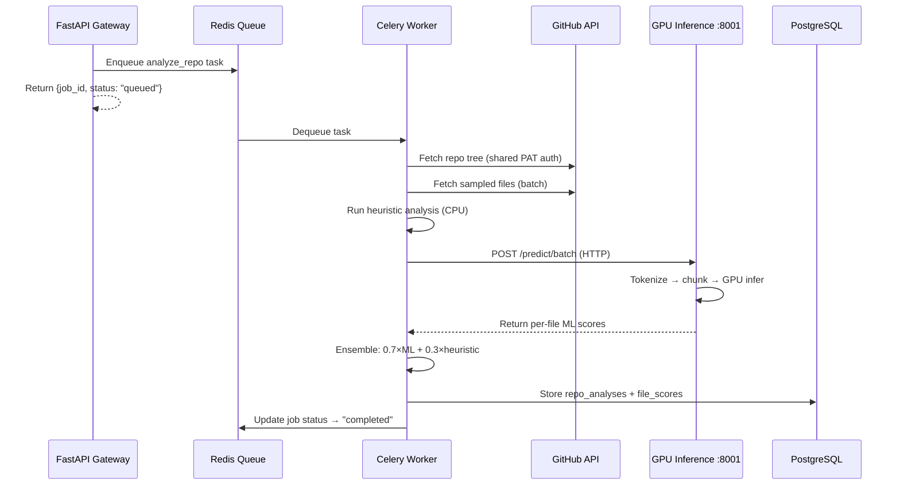

# Phase 2 — Backend & AI Integration: Detailed Plan

> **SynthCode · Weeks 4–8 · Deep Implementation Blueprint**
>
> **Decisions Locked:** Separate GPU inference service · Single shared GitHub PAT

---

## Overview

Phase 2 transforms SynthCode from a mock-data extension shell into a fully functional analysis pipeline. By the end of this phase, the extension will hit a live backend, which fetches real GitHub repo files, runs them through an ensemble AI/heuristic scorer, and returns a confidence score.

### Workstreams at a Glance



---

## WS1: FastAPI Project Scaffold

### 1.1 Project Directory Structure

```
backend/                             # ── API Gateway (CPU-only) ──
├── app/
│   ├── __init__.py
│   ├── main.py                      # FastAPI app factory, CORS, lifespan
│   ├── config.py                    # Pydantic Settings (env-based config)
│   ├── api/
│   │   ├── __init__.py
│   │   ├── v1/
│   │   │   ├── __init__.py
│   │   │   ├── router.py            # Aggregates all v1 route modules
│   │   │   ├── analyze.py           # POST /analyze, GET /results, GET /status
│   │   │   └── health.py            # GET /health
│   │   └── deps.py                  # Shared dependencies (DB session, Redis, auth)
│   ├── models/
│   │   ├── __init__.py
│   │   ├── db.py                    # SQLAlchemy ORM models
│   │   └── schemas.py               # Pydantic request/response schemas
│   ├── services/
│   │   ├── __init__.py
│   │   ├── github_fetcher.py        # GitHub API integration
│   │   ├── sampler.py               # File sampling strategy
│   │   ├── heuristic.py             # Heuristic signal extraction
│   │   ├── inference_client.py      # HTTP client → GPU inference service
│   │   └── scorer.py                # Ensemble aggregation (0.7 ML + 0.3 heuristic)
│   ├── workers/
│   │   ├── __init__.py
│   │   ├── celery_app.py            # Celery configuration
│   │   └── tasks.py                 # Async analysis task definitions
│   ├── cache/
│   │   ├── __init__.py
│   │   └── redis_client.py          # Redis connection, cache get/set, rate limiter
│   └── db/
│       ├── __init__.py
│       ├── session.py               # SQLAlchemy async engine + session factory
│       └── migrations/              # Alembic migration directory
│           ├── env.py
│           └── versions/
├── tests/
│   ├── conftest.py
│   ├── test_api/
│   ├── test_services/
│   └── test_workers/
├── Dockerfile                       # CPU-only image (slim)
├── docker-compose.yml               # API + Worker + PG + Redis + Inference
├── pyproject.toml
├── alembic.ini
└── .env.example

inference/                           # ── GPU Inference Service (separate deploy) ──
├── app/
│   ├── __init__.py
│   ├── main.py                      # FastAPI app, model loading on startup
│   ├── config.py                    # Model path, device, batch size settings
│   ├── model_loader.py              # Load CodeBERT + classifier head into GPU memory
│   ├── predictor.py                 # Tokenize → chunk → batch infer → aggregate
│   └── schemas.py                   # Request/response Pydantic models
├── ml/
│   ├── train.py                     # Model training script
│   ├── evaluate.py                  # Evaluation & benchmarking
│   ├── dataset/
│   │   ├── collect.py               # GitHub scraper for human code
│   │   ├── generate.py              # AI-generated code collector
│   │   └── preprocess.py            # Tokenization, chunking, labeling
│   └── weights/                     # Saved model checkpoints
│       └── .gitkeep
├── tests/
│   ├── test_predictor.py
│   └── test_api.py
├── Dockerfile.gpu                   # NVIDIA CUDA base image
├── pyproject.toml                   # torch, transformers, fastapi, uvicorn
└── .env.example
```

### 1.2 Key Dependencies

#### `backend/pyproject.toml` (API Gateway — CPU only, no torch)

```toml
[project]
dependencies = [
    "fastapi>=0.115",
    "uvicorn[standard]>=0.30",
    "sqlalchemy[asyncio]>=2.0",
    "asyncpg>=0.30",           # Async PostgreSQL driver
    "alembic>=1.14",
    "redis>=5.0",
    "celery[redis]>=5.4",
    "httpx>=0.28",             # Async HTTP client (GitHub API + inference service)
    "pydantic-settings>=2.5",
    "python-dotenv>=1.0",
]
```

#### `inference/pyproject.toml` (GPU Inference Service)

```toml
[project]
dependencies = [
    "fastapi>=0.115",
    "uvicorn[standard]>=0.30",
    "transformers>=4.45",
    "torch>=2.4",
    "safetensors>=0.4",
    "pydantic-settings>=2.5",
    "python-dotenv>=1.0",
]
```

### 1.3 Docker Compose (Dev)

```yaml
services:
  # ── API Gateway (CPU) ──
  api:
    build:
      context: ./backend
      dockerfile: Dockerfile
    ports: ["8000:8000"]
    env_file: .env
    depends_on: [db, redis, inference]
    volumes: ["./backend/app:/code/app"]
    command: uvicorn app.main:app --host 0.0.0.0 --reload

  # ── Celery Worker (CPU) ──
  worker:
    build:
      context: ./backend
      dockerfile: Dockerfile
    env_file: .env
    depends_on: [db, redis, inference]
    command: celery -A app.workers.celery_app worker -l info -c 2

  # ── GPU Inference Service ──
  inference:
    build:
      context: ./inference
      dockerfile: Dockerfile.gpu
    ports: ["8001:8001"]
    env_file: .env.inference
    volumes: ["./inference/ml/weights:/code/ml/weights"]
    command: uvicorn app.main:app --host 0.0.0.0 --port 8001
    deploy:
      resources:
        reservations:
          devices:
            - driver: nvidia
              count: 1
              capabilities: [gpu]

  # ── Data Stores ──
  db:
    image: postgres:16-alpine
    environment:
      POSTGRES_DB: synthcode
      POSTGRES_USER: synthcode
      POSTGRES_PASSWORD: dev_password
    ports: ["5432:5432"]
    volumes: ["pgdata:/var/lib/postgresql/data"]

  redis:
    image: redis:7-alpine
    ports: ["6379:6379"]

volumes:
  pgdata:
```

### 1.4 Config Management (`config.py`)

#### `backend/app/config.py` (API Gateway)

```python
from pydantic_settings import BaseSettings

class Settings(BaseSettings):
    # App
    APP_ENV: str = "development"
    APP_DEBUG: bool = True

    # Database
    DATABASE_URL: str = "postgresql+asyncpg://synthcode:dev_password@db:5432/synthcode"

    # Redis
    REDIS_URL: str = "redis://redis:6379/0"

    # GitHub — Single shared PAT (5,000 req/hr across all users)
    GITHUB_TOKEN: str = ""            # Server-side PAT, never exposed to clients
    GITHUB_API_BASE: str = "https://api.github.com"

    # GPU Inference Service
    INFERENCE_SERVICE_URL: str = "http://inference:8001"  # Docker-internal
    INFERENCE_TIMEOUT: int = 30       # seconds per batch request
    INFERENCE_MAX_RETRIES: int = 2

    # Rate Limiting
    RATE_LIMIT_ANON: int = 5
    RATE_LIMIT_AUTH: int = 20
    RATE_LIMIT_WINDOW: int = 3600     # seconds

    # Analysis
    MAX_FILES_PER_REPO: int = 30
    CACHE_TTL_REDIS: int = 3600       # 1 hour
    CACHE_TTL_DB_DAYS: int = 7

    class Config:
        env_file = ".env"
```

#### `inference/app/config.py` (GPU Service)

```python
from pydantic_settings import BaseSettings

class InferenceSettings(BaseSettings):
    MODEL_PATH: str = "./ml/weights/codebert-ai-detector"
    MODEL_DEVICE: str = "cuda"        # Always GPU in this service
    MAX_BATCH_SIZE: int = 16          # Files per batch
    MAX_TOKENS: int = 512             # CodeBERT context window
    CHUNK_OVERLAP: int = 64
    WARMUP_ON_STARTUP: bool = True    # Run dummy inference on startup

    class Config:
        env_file = ".env.inference"
```

### 1.5 CI Pipeline (GitHub Actions)

```yaml
# .github/workflows/ci.yml
name: Backend CI
on: [push, pull_request]
jobs:
  lint-and-test:
    runs-on: ubuntu-latest
    services:
      postgres:
        image: postgres:16-alpine
        env: { POSTGRES_DB: test, POSTGRES_USER: test, POSTGRES_PASSWORD: test }
        ports: ["5432:5432"]
      redis:
        image: redis:7-alpine
        ports: ["6379:6379"]
    steps:
      - uses: actions/checkout@v4
      - uses: astral-sh/setup-uv@v4
      - run: uv sync
      - run: uv run ruff check app/
      - run: uv run ruff format --check app/
      - run: uv run pytest tests/ -v --cov=app --cov-report=term-missing
```

---

## WS2: GitHub Integration Service

### 2.1 Data Flow



### 2.2 `github_fetcher.py` — Interface Contract

```python
@dataclass
class FileContent:
    path: str           # e.g. "src/utils/parser.ts"
    language: str       # e.g. "typescript"
    size_bytes: int
    content: str        # raw decoded source code
    sha: str            # blob SHA for cache invalidation

class GitHubFetcher:
    async def validate_repo(self, owner: str, repo: str) -> RepoMeta
    async def fetch_tree(self, owner: str, repo: str, branch: str) -> list[TreeEntry]
    async def fetch_file_content(self, owner: str, repo: str, path: str) -> FileContent
    async def fetch_files_batch(self, owner: str, repo: str, paths: list[str]) -> list[FileContent]
```

### 2.3 `sampler.py` — Stratified File Selection

**Rules:**

| Rule | Detail |
|---|---|
| **Max files** | 30 per analysis |
| **Supported extensions** | `.py`, `.js`, `.ts`, `.jsx`, `.tsx`, `.java`, `.go`, `.rs`, `.cpp`, `.c`, `.cs`, `.rb`, `.php`, `.swift`, `.kt` |
| **Excluded paths** (regex) | `node_modules/`, `vendor/`, `dist/`, `build/`, `__pycache__/`, `.min.js`, `package-lock.json`, `go.sum`, `yarn.lock`, `*.generated.*` |
| **Min file size** | 200 bytes (skip trivial files) |
| **Max file size** | 100 KB (skip giant data files) |
| **Priority weighting** | Files in `src/`, `lib/`, `app/`, `pkg/`, `internal/` get 2× weight; largest files within each tier get 1.5× weight |

```python
class FileSampler:
    def sample(self, tree: list[TreeEntry], max_files: int = 30) -> list[TreeEntry]:
        """Returns a stratified sample of source files from the repo tree."""
```

### 2.4 GitHub API Rate-Limit Management

| Strategy | Implementation |
|---|---|
| **Authenticated requests** | Include `Authorization: Bearer {GITHUB_TOKEN}` for 5,000 req/hr |
| **Rate-limit header monitoring** | Read `X-RateLimit-Remaining` and `X-RateLimit-Reset` from every response |
| **Backoff** | If remaining < 100, throttle to 1 req/sec; if remaining = 0, sleep until reset |
| **Batch optimization** | Use Tree API (1 call for entire tree) instead of per-directory listing |
| **Content caching** | Cache file contents by blob SHA in Redis (immutable content) |

---

## WS3: Heuristic Analysis Engine

### 3.1 Signal Extractors

The heuristic engine computes 6 independent signals, each normalized to `[0.0, 1.0]`:

| # | Signal | What It Detects | Method |
|---|---|---|---|
| 1 | **Comment Uniformity** | AI tends to produce evenly-spaced, formulaic comments | Std deviation of comment line spacing; low variance → high AI signal |
| 2 | **Naming Entropy** | AI uses descriptive but homogeneous naming (`handleUserInput`, `processDataResult`) | Shannon entropy of identifier tokens; low entropy → high AI signal |
| 3 | **Boilerplate Ratio** | AI over-generates common patterns (try/catch, null checks, type guards) | Count template-match hits against a library of ~50 boilerplate patterns |
| 4 | **Code Structure Repetition** | AI repeats similar function shapes across a file | AST-based function signature similarity (Jaccard on token bags) |
| 5 | **Comment-to-Code Ratio** | AI tends to over-comment or under-comment in predictable ways | Ratio of comment lines to code lines, compared against language-specific baselines |
| 6 | **Import/Dependency Style** | AI tends to import everything upfront in a canonical order | Compare import block structure against known AI patterns (alphabetized, grouped) |

### 3.2 Composite Heuristic Score

```python
class HeuristicAnalyzer:
    def analyze_file(self, content: str, language: str) -> HeuristicResult:
        """Returns per-signal scores and a weighted composite."""

@dataclass
class HeuristicResult:
    comment_uniformity: float    # 0.0–1.0
    naming_entropy: float
    boilerplate_ratio: float
    structure_repetition: float
    comment_code_ratio: float
    import_style: float
    composite: float             # weighted average

# Weights (tunable):
SIGNAL_WEIGHTS = {
    "comment_uniformity":    0.20,
    "naming_entropy":        0.20,
    "boilerplate_ratio":     0.15,
    "structure_repetition":  0.20,
    "comment_code_ratio":    0.10,
    "import_style":          0.15,
}
```

### 3.3 Language Support Matrix

| Language | Comment Parsing | AST Available | Import Analysis |
|---|---|---|---|
| Python | ✅ `#`, `"""` | ✅ `ast` stdlib | ✅ `import`/`from` |
| JavaScript/TS | ✅ `//`, `/* */` | ⚠️ regex-based | ✅ `import`/`require` |
| Java | ✅ `//`, `/* */` | ⚠️ regex-based | ✅ `import` |
| Go | ✅ `//`, `/* */` | ⚠️ regex-based | ✅ `import` |
| Rust | ✅ `//`, `/* */` | ⚠️ regex-based | ✅ `use` |
| C/C++ | ✅ `//`, `/* */` | ⚠️ regex-based | ✅ `#include` |

> [!NOTE]
> MVP will use regex-based parsing for all languages except Python (which has a stdlib AST). Full AST support (tree-sitter) is a Phase 3 upgrade.

---

## WS4: ML Model Pipeline

### 4.1 Dataset Curation



#### Human Code Sources (Label: 0)

| Source | Volume | Method |
|---|---|---|
| GitHub pre-2021 repos | ~50K files | Scrape popular repos created before GPT-3.5 era |
| Curated open-source projects | ~10K files | Hand-picked projects with known human authorship (Linux kernel, CPython, etc.) |
| Competitive programming | ~5K files | Codeforces/LeetCode submissions from pre-AI era |

#### AI-Generated Code (Label: 1)

| Source | Volume | Method |
|---|---|---|
| GPT-4o / Claude / Gemini outputs | ~30K files | Prompt LLMs with diverse coding tasks, collect outputs |
| Copilot completions | ~15K files | Collect Copilot suggestions across various contexts |
| AI coding benchmarks | ~5K files | HumanEval, MBPP, SWE-Bench generated solutions |

#### Total: ~115K labeled files → 80/10/10 train/val/test split

### 4.2 Preprocessing Pipeline

```python
# ml/dataset/preprocess.py

class CodePreprocessor:
    MAX_TOKENS = 512          # CodeBERT max context
    OVERLAP = 64              # Sliding window overlap

    def process_file(self, content: str, language: str) -> list[dict]:
        """
        1. Strip comments (optional — ablation will determine)
        2. Normalize whitespace
        3. Tokenize with CodeBERT tokenizer
        4. Chunk into 512-token windows with 64-token overlap
        5. Return list of {input_ids, attention_mask, label}
        """
```

### 4.3 Model Architecture

```
┌─────────────────────────────────┐
│     CodeBERT (frozen/unfrozen)  │   ← microsoft/codebert-base (125M params)
│     768-dim hidden states       │
└──────────────┬──────────────────┘
               │ [CLS] token embedding
               ▼
┌─────────────────────────────────┐
│     Classification Head         │
│     Linear(768, 256)            │
│     ReLU + Dropout(0.3)         │
│     Linear(256, 1)              │
│     Sigmoid                     │
└──────────────┬──────────────────┘
               │
               ▼
        P(AI-generated) ∈ [0, 1]
```

### 4.4 Training Configuration

| Hyperparameter | Value | Notes |
|---|---|---|
| Base model | `microsoft/codebert-base` | 125M params, pre-trained on 6 languages |
| Learning rate | 2e-5 | Standard for BERT fine-tuning |
| Batch size | 32 | Per GPU |
| Epochs | 5 | With early stopping (patience=2) |
| Optimizer | AdamW | Weight decay 0.01 |
| Loss | Binary Cross-Entropy | Sigmoid output |
| Frozen layers | First 8 (of 12) | Freeze early layers, fine-tune top 4 + classifier head |
| Mixed precision | FP16 | Speed + memory savings |
| Hardware | 1× NVIDIA T4 (GCP) | ~4 hrs training on 115K files |

### 4.5 GPU Inference Service — Detailed Architecture

The ML model runs as a **standalone FastAPI microservice** on a GPU-equipped instance, completely decoupled from the API gateway.

#### Why Separate?

| Concern | API Gateway | GPU Inference Service |
|---|---|---|
| **Hardware** | CPU (2 vCPU, 2 GB) | GPU (NVIDIA T4, 16 GB VRAM) |
| **Scaling** | Horizontal (many replicas) | Vertical (bigger GPU) or queue-based |
| **Deploy cadence** | Frequent (API changes) | Rare (model updates only) |
| **Docker image** | ~200 MB (slim Python) | ~5 GB (CUDA + PyTorch + model weights) |
| **Cost** | ~$30/mo (Cloud Run) | ~$150/mo (GCE with T4) |
| **Cold start** | ~2s | ~30s (model loading) — use min-instances=1 |

#### Inference Service Architecture



#### Inference API Contract

```python
# POST http://inference:8001/predict/batch
# Request:
{
    "files": [
        {"path": "src/index.ts", "language": "typescript", "content": "..."},
        {"path": "src/utils.py", "language": "python", "content": "..."}
    ]
}

# Response:
{
    "scores": [
        {"path": "src/index.ts", "score": 0.85, "chunks_analyzed": 3},
        {"path": "src/utils.py", "score": 0.42, "chunks_analyzed": 1}
    ],
    "model_version": "v1.2.0",
    "inference_time_ms": 340
}
```

#### `inference/app/main.py` — Service Entrypoint

```python
from contextlib import asynccontextmanager
from fastapi import FastAPI
from app.config import InferenceSettings
from app.model_loader import ModelLoader
from app.predictor import Predictor
from app.schemas import PredictRequest, PredictResponse

settings = InferenceSettings()

@asynccontextmanager
async def lifespan(app: FastAPI):
    # Load model into GPU on startup
    loader = ModelLoader(settings.MODEL_PATH, settings.MODEL_DEVICE)
    app.state.predictor = Predictor(loader.model, loader.tokenizer, settings)
    if settings.WARMUP_ON_STARTUP:
        app.state.predictor.warmup()  # Dummy inference to prime CUDA kernels
    yield
    # Cleanup on shutdown
    del app.state.predictor

app = FastAPI(title="SynthCode Inference", lifespan=lifespan)

@app.post("/predict/batch", response_model=PredictResponse)
async def predict_batch(request: PredictRequest):
    return app.state.predictor.predict_batch(request.files)

@app.get("/health")
async def health():
    return {"status": "ok", "gpu": torch.cuda.is_available()}
```

#### `inference/app/predictor.py` — Core Inference Logic

```python
import torch
from transformers import AutoTokenizer

class Predictor:
    def __init__(self, model, tokenizer: AutoTokenizer, settings):
        self.model = model
        self.tokenizer = tokenizer
        self.max_tokens = settings.MAX_TOKENS
        self.overlap = settings.CHUNK_OVERLAP
        self.device = settings.MODEL_DEVICE

    def predict_batch(self, files: list[FileInput]) -> PredictResponse:
        results = []
        for file in files:
            chunks = self._chunk_file(file.content)
            if not chunks:
                results.append(FileScore(path=file.path, score=0.0, chunks_analyzed=0))
                continue
            scores = self._infer_chunks(chunks)
            avg_score = sum(scores) / len(scores)
            results.append(FileScore(path=file.path, score=avg_score, chunks_analyzed=len(chunks)))
        return PredictResponse(scores=results, model_version=self._model_version())

    def _chunk_file(self, content: str) -> list[dict]:
        """Tokenize and split into overlapping 512-token windows."""
        tokens = self.tokenizer(content, truncation=False, return_tensors="pt")
        input_ids = tokens["input_ids"][0]
        chunks = []
        start = 0
        while start < len(input_ids):
            end = min(start + self.max_tokens, len(input_ids))
            chunks.append(input_ids[start:end])
            if end >= len(input_ids):
                break
            start += self.max_tokens - self.overlap
        return chunks

    @torch.no_grad()
    def _infer_chunks(self, chunks: list) -> list[float]:
        """Batch-run chunks through the model on GPU."""
        padded = torch.nn.utils.rnn.pad_sequence(chunks, batch_first=True).to(self.device)
        attention_mask = (padded != self.tokenizer.pad_token_id).long().to(self.device)
        logits = self.model(input_ids=padded, attention_mask=attention_mask).logits
        probs = torch.sigmoid(logits).squeeze(-1).cpu().tolist()
        return probs if isinstance(probs, list) else [probs]

    def warmup(self):
        """Run dummy inference to prime CUDA kernels."""
        dummy = self.tokenizer("def hello(): pass", return_tensors="pt", truncation=True)
        dummy = {k: v.to(self.device) for k, v in dummy.items()}
        self.model(**dummy)
```

#### `inference/Dockerfile.gpu`

```dockerfile
FROM nvidia/cuda:12.4.1-runtime-ubuntu22.04

# System deps
RUN apt-get update && apt-get install -y python3.11 python3-pip && rm -rf /var/lib/apt/lists/*

WORKDIR /code
COPY pyproject.toml .
RUN pip install --no-cache-dir .

COPY app/ ./app/
COPY ml/weights/ ./ml/weights/

EXPOSE 8001
CMD ["uvicorn", "app.main:app", "--host", "0.0.0.0", "--port", "8001"]
```

#### GCP Production Deployment

| Setting | Value |
|---|---|
| **Service** | GCE VM with NVIDIA T4 (or GKE GPU node pool) |
| **Machine type** | `n1-standard-4` + 1× T4 GPU |
| **Min instances** | 1 (always warm — avoids 30s cold start) |
| **Max instances** | 3 (auto-scale on request queue depth) |
| **Health check** | `GET /health` every 30s |
| **Model updates** | Rolling deploy: new container with updated weights, drain old |
| **Estimated cost** | ~$150–200/mo per instance |

### 4.6 Inference Client (API Gateway Side)

The API gateway calls the GPU service over HTTP via `inference_client.py`:

```python
# backend/app/services/inference_client.py

import httpx
from app.config import Settings

class InferenceClient:
    def __init__(self, settings: Settings):
        self.base_url = settings.INFERENCE_SERVICE_URL
        self.timeout = settings.INFERENCE_TIMEOUT
        self.max_retries = settings.INFERENCE_MAX_RETRIES

    async def predict_batch(self, files: list[FileContent]) -> list[FileScore]:
        """
        Send files to the GPU inference service and return per-file scores.
        Retries on transient failures with exponential backoff.
        """
        payload = {
            "files": [
                {"path": f.path, "language": f.language, "content": f.content}
                for f in files
            ]
        }
        async with httpx.AsyncClient(timeout=self.timeout) as client:
            for attempt in range(self.max_retries + 1):
                try:
                    resp = await client.post(
                        f"{self.base_url}/predict/batch",
                        json=payload
                    )
                    resp.raise_for_status()
                    data = resp.json()
                    return [
                        FileScore(path=s["path"], score=s["score"])
                        for s in data["scores"]
                    ]
                except (httpx.ConnectError, httpx.ReadTimeout) as e:
                    if attempt == self.max_retries:
                        raise InferenceServiceError(f"GPU service unreachable: {e}")
                    await asyncio.sleep(2 ** attempt)  # Exponential backoff

    async def health_check(self) -> bool:
        async with httpx.AsyncClient(timeout=5) as client:
            resp = await client.get(f"{self.base_url}/health")
            return resp.status_code == 200
```

### 4.6 Ensemble Scoring (`scorer.py`)

```python
class EnsembleScorer:
    ML_WEIGHT = 0.70
    HEURISTIC_WEIGHT = 0.30
    THRESHOLD = 0.50

    def score_repo(
        self,
        ml_scores: list[FileScore],
        heuristic_scores: list[HeuristicResult]
    ) -> RepoScore:
        """
        1. Compute weighted per-file score:
           file_score = 0.7 * ml_score + 0.3 * heuristic_composite
        2. Aggregate across files:
           overall = weighted_mean(file_scores, weights=file_sizes)
        3. Apply label:
           < 0.30 → "human"
           0.30–0.50 → "mixed"
           > 0.50 → "ai-coded"
        """
```

> [!IMPORTANT]
> **File-size weighting**: Larger files get more weight in the aggregate score because they carry more signal. A 500-line file matters more than a 10-line utility.

---

## WS5: Celery Async Pipeline

### 5.1 Why Async?

A full analysis (fetch 30 files + ML inference) takes **5–15 seconds**. This exceeds reasonable HTTP timeout expectations. The solution:

1. `POST /analyze` returns immediately with a `job_id`
2. The client polls `GET /status/{job_id}` until complete
3. Final results available at `GET /results/{owner}/{repo}`

### 5.2 Task Flow



### 5.3 Task Definition

```python
# app/workers/tasks.py

@celery_app.task(bind=True, max_retries=2, soft_time_limit=120)
def analyze_repo(self, owner: str, repo: str, branch: str, job_id: str):
    """
    Full analysis pipeline:
    1. Validate repo exists
    2. Fetch and sample files
    3. Run heuristic analysis on each file
    4. Run ML inference on each file
    5. Compute ensemble score
    6. Persist results to PostgreSQL
    7. Cache results in Redis
    8. Update job status
    """
```

### 5.4 Job Status Lifecycle

```
queued → processing → completed
                   → failed (with error message)
                   → timeout (soft_time_limit exceeded)
```

Status stored in Redis with 1-hour TTL:

```python
# Key: "job:{job_id}"
# Value: {"status": "processing", "progress": 60, "message": "Running ML inference..."}
```

### 5.5 API Status Endpoint

```python
# GET /api/v1/status/{job_id}
# Response:
{
    "job_id": "abc-123",
    "status": "processing",       # queued | processing | completed | failed
    "progress": 60,               # 0–100 percentage
    "message": "Running ML inference...",
    "result_url": null             # populated when completed
}
```

---

## WS6: Database & Cache Infrastructure

### 6.1 Alembic Migration Strategy

```python
# Initial migration: creates repo_analyses, file_scores, api_usage tables
# See schema in main planning doc §4.2

# Additional indexes for performance:
CREATE INDEX idx_analyses_owner_repo ON repo_analyses(owner, repo);
CREATE INDEX idx_analyses_expires ON repo_analyses(expires_at);
CREATE INDEX idx_file_scores_analysis ON file_scores(analysis_id);
CREATE INDEX idx_api_usage_client ON api_usage(client_id, called_at);
```

### 6.2 Redis Cache Design

| Key Pattern | Value | TTL | Purpose |
|---|---|---|---|
| `score:{owner}:{repo}:{branch}` | JSON result payload | 1 hour | Hot cache for repeated lookups |
| `tree:{owner}:{repo}:{branch}:{sha}` | Compressed tree JSON | 24 hours | Avoid re-fetching unchanged trees |
| `blob:{sha}` | Raw file content | 24 hours | Immutable blob content cache |
| `job:{job_id}` | Job status JSON | 1 hour | Analysis progress tracking |
| `rate:{client_id}` | Sorted set of timestamps | Rolling window | Sliding-window rate limiter |

### 6.3 Rate Limiter Implementation

```python
# app/cache/redis_client.py

class RateLimiter:
    async def check_and_increment(self, client_id: str, tier: str) -> RateLimitResult:
        """
        Sliding-window counter using Redis sorted sets.

        1. ZREMRANGEBYSCORE — remove entries older than window
        2. ZCARD — count remaining entries
        3. If count < limit → ZADD current timestamp, return allowed
        4. If count >= limit → return denied with retry_after
        """

@dataclass
class RateLimitResult:
    allowed: bool
    remaining: int
    limit: int
    retry_after: int | None    # seconds until next window
```

### 6.4 Cache Invalidation Rules

| Trigger | Action |
|---|---|
| `force_rescan = true` | Delete Redis key `score:{owner}:{repo}:{branch}`, run fresh analysis |
| Latest commit SHA differs from cached `scanned_commit_sha` | Invalidate and re-analyze |
| `expires_at` passed in PostgreSQL | DB record ignored, treated as cache miss |
| Model version upgrade | Batch-invalidate all records with old `model_version` |

---

## WS7: Extension ↔ Backend Wiring

### 7.1 Changes to Extension Service Worker

Replace mock API calls in `background.js` with real HTTP calls:

```javascript
// background.js (service worker)

const API_BASE = "https://api.synthcode.dev/api/v1";

async function analyzeRepo(owner, repo, branch = "main") {
  // 1. Submit analysis
  const { job_id } = await fetch(`${API_BASE}/analyze`, {
    method: "POST",
    headers: { "Content-Type": "application/json" },
    body: JSON.stringify({ owner, repo, branch }),
  }).then(r => r.json());

  // 2. Poll for completion
  return pollJobStatus(job_id);
}

async function pollJobStatus(jobId, maxAttempts = 30, intervalMs = 2000) {
  for (let i = 0; i < maxAttempts; i++) {
    const status = await fetch(`${API_BASE}/status/${jobId}`).then(r => r.json());
    if (status.status === "completed") {
      return fetch(status.result_url).then(r => r.json());
    }
    if (status.status === "failed") {
      throw new Error(status.message);
    }
    await new Promise(r => setTimeout(r, intervalMs));
  }
  throw new Error("Analysis timed out");
}
```

### 7.2 Content Script Updates

| Change | Detail |
|---|---|
| Replace static mock badge | Dynamic badge colored by real score |
| Add loading state | "Analyzing…" spinner with progress percentage from `/status` |
| Add error state | "Analysis failed — retry?" with retry button |
| Cache real scores | Store `{owner, repo, score, scannedAt}` in `chrome.storage.local` |

---

## Weekly Sprint Breakdown

### Week 4 (Sprint 1)

| Day | Task | Owner |
|---|---|---|
| Mon–Tue | WS1: FastAPI scaffold, Docker Compose, basic health endpoint | Backend |
| Wed–Thu | WS2: GitHub fetcher — tree API, file content fetch, error handling | Backend |
| Fri | WS2: File sampler — filtering, weighting, unit tests | Backend |

**Deliverable:** Docker Compose spins up, `/health` returns 200, GitHub fetcher retrieves real repo trees.

### Week 5 (Sprint 2)

| Day | Task | Owner |
|---|---|---|
| Mon–Wed | WS3: Heuristic engine — all 6 signal extractors for Python & JS | ML/Backend |
| Thu–Fri | WS4: Dataset collection — begin scraping human code sources | ML |

**Deliverable:** Heuristic analyzer returns composite score for Python/JS files.

### Week 6 (Sprint 3)

| Day | Task | Owner |
|---|---|---|
| Mon–Tue | WS4: Dataset — collect AI-generated samples, preprocessing pipeline | ML |
| Wed–Fri | WS4: Fine-tune CodeBERT — training, validation, checkpoint selection | ML |

**Deliverable:** Trained model checkpoint with >0.80 F1 on validation set.

### Week 7 (Sprint 4)

| Day | Task | Owner |
|---|---|---|
| Mon–Tue | WS4: GPU inference service — FastAPI, model loader, predictor, Dockerfile.gpu | ML/Backend |
| Wed | WS4: Inference client in API gateway, health check, retry logic | Backend |
| Thu | WS5: Celery pipeline — task definition, Redis broker, job status | Backend |
| Fri | WS6: PostgreSQL Alembic migrations, Redis cache layer | Backend |

**Deliverable:** Full async pipeline: submit → queue → fetch → GPU infer → store → retrieve.

### Week 8 (Sprint 5)

| Day | Task | Owner |
|---|---|---|
| Mon–Tue | WS6: Rate limiter, cache invalidation logic | Backend |
| Wed–Thu | WS7: Extension wiring — replace mock, add loading/error states | Frontend |
| Fri | Integration testing — end-to-end smoke tests | All |

**Deliverable:** Extension triggers real analysis, results render with live scores.

---

## Verification Plan

### Automated Tests

| Test Suite | Coverage Target | Framework |
|---|---|---|
| `test_api/` — endpoint contracts | 90% route coverage | `pytest` + `httpx.AsyncClient` |
| `test_services/github_fetcher` | Mock GitHub API responses | `pytest` + `respx` |
| `test_services/sampler` | Edge cases (empty repos, huge repos, no source files) | `pytest` |
| `test_services/heuristic` | Known-signal files (hand-crafted fixtures) | `pytest` |
| `test_services/ml_classifier` | Mock model predictions | `pytest` |
| `test_workers/tasks` | Task lifecycle (queued → completed → failed) | `pytest` + Celery test utils |
| ML model evaluation | F1 ≥ 0.80, FPR ≤ 15% on held-out test set | `ml/evaluate.py` |

### Integration Tests

| Test | Method |
|---|---|
| End-to-end happy path | Submit analysis for a known repo, verify score returns |
| Rate limiting | Exceed tier limit, verify 429 response |
| Cache hit | Analyze same repo twice, verify second call uses cache |
| GitHub API failure | Mock 403/500 from GitHub, verify graceful error |
| Celery timeout | Submit task that exceeds `soft_time_limit`, verify timeout status |

### Manual Verification

| Check | Method |
|---|---|
| Extension shows real badge | Load extension, navigate to a test repo, verify badge renders |
| Loading state works | Trigger cold analysis, verify spinner + progress percentage |
| Error state works | Disconnect backend, verify error UI with retry button |

---

## Open Questions

> [!WARNING]
> **Dataset licensing**: Scraping GitHub repos for training data — need to confirm compliance with GitHub ToS and repository licenses (MIT/Apache are safe; GPL-licensed code used only for analysis features, not redistributed).

---

*Phase 2 plan — SynthCode Backend & AI Integration. Weeks 4–8.*
