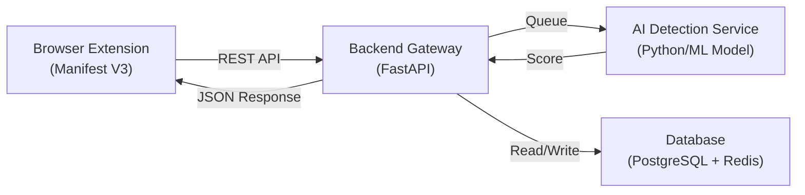
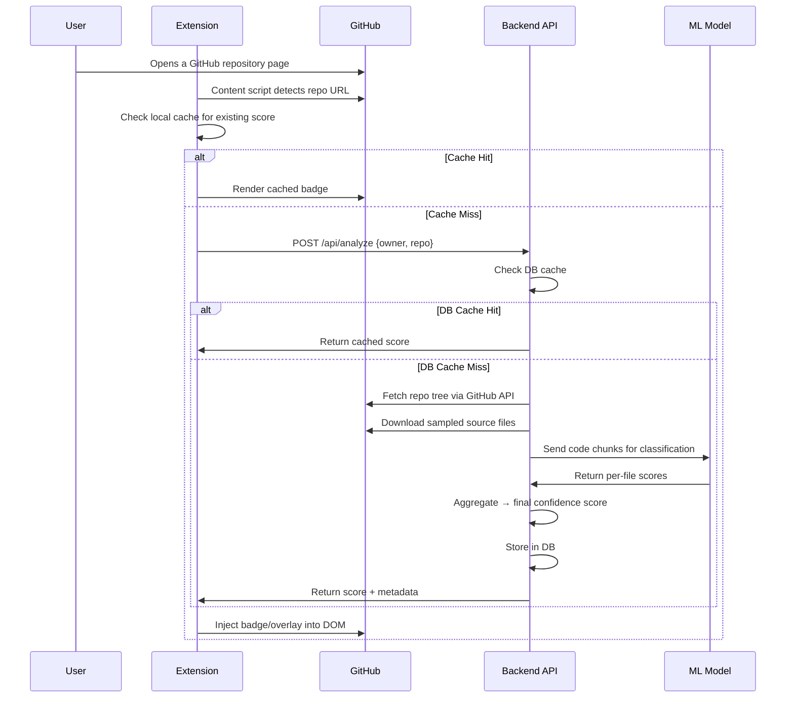

# SynthCode — Project Planning Document

> **Browser Extension for AI-Generated Code Detection on GitHub**
> Version 1.0 · May 2026

---

## 1. Product Vision

SynthCode is a lightweight Chromium-based browser extension (Manifest V3) that analyzes GitHub repositories and surfaces a confidence score indicating how likely the codebase is AI-generated. When the score exceeds **50%**, the repository is visually flagged as **"AI-coded"** directly in the GitHub UI.

### Target User

Recruiters, hiring managers, open-source maintainers, and educators who need a quick signal about code originality — without leaving GitHub.

---

## 2. Architecture & Tech Stack

### 2.1 High-Level Architecture



### 2.2 Extension (Client)

| Layer | Technology | Rationale |
|---|---|---|
| Manifest | **Manifest V3** | Chrome requirement for new extensions |
| UI Popups | **Vanilla HTML/CSS/JS** | Lightweight, no build step needed for MVP |
| Content Scripts | **Vanilla JS** | Injects badges & overlays into GitHub DOM |
| Service Worker | **Background SW** | Handles API calls, caching, auth tokens |
| Storage | **chrome.storage.local** | Persists cached scores client-side |

### 2.3 Backend

| Component | Technology | Rationale |
|---|---|---|
| API Gateway | **FastAPI (Python)** | Async, fast, easy ML integration |
| Task Queue | **Celery + Redis** | Offload long-running analysis jobs |
| Database | **PostgreSQL** | Persistent repo scores & user data |
| Cache | **Redis** | Rate-limiting, hot-path score cache |
| AI Model | **Custom fine-tuned classifier** | CodeBERT / StarCoder-based binary classifier |
| Hosting | **GCP Cloud Run + Cloud SQL** | Scalable, cost-effective |

### 2.4 AI Detection Model Strategy

| Approach | Description |
|---|---|
| **Primary** | Fine-tuned CodeBERT/UniXcoder classifier trained on labeled human vs. AI-generated code |
| **Heuristic layer** | Static analysis signals (entropy, naming patterns, comment density, boilerplate ratio) |
| **Ensemble** | Weighted average of ML score + heuristic score for final confidence |

---

## 3. Core Features & Workflow

### 3.1 User Workflow



### 3.2 GitHub UI Parsing & Injection

The content script targets these DOM locations:

| GitHub Page | Injection Point | What's Rendered |
|---|---|---|
| Repo main page | Next to repo title `<h1>` | Confidence badge (pill) |
| Repo main page | Below "About" sidebar | Detailed score card |
| File view | File header bar | Per-file mini badge |

**DOM Resilience:** Use `MutationObserver` to handle GitHub's SPA (Turbo/PJAX) navigation and re-inject on route changes.

### 3.3 File Sampling Strategy

Full-repo analysis is expensive. The backend uses **stratified sampling**:

1. Fetch the repo tree via GitHub's Tree API (`GET /repos/{owner}/{repo}/git/trees/{branch}?recursive=1`)
2. Filter to supported extensions (`.js`, `.ts`, `.py`, `.java`, `.cpp`, `.go`, `.rs`, etc.)
3. Exclude vendored/generated paths (`node_modules/`, `dist/`, `*.min.js`, `package-lock.json`)
4. Sample up to **30 files**, weighted toward:
   - Largest files (more signal)
   - Core source directories (`src/`, `lib/`, `app/`)
5. Fetch raw content via GitHub's Contents API (base64-decoded)

### 3.4 Scoring Model

```
Final Score = 0.7 × ML_Score + 0.3 × Heuristic_Score
```

- **ML_Score:** Average of per-file classifier probabilities
- **Heuristic_Score:** Composite of static signals (comment uniformity, naming entropy, code structure repetition)
- **Threshold:** Score > 0.50 → flagged as "AI-coded"

### 3.5 Extension UI Components

| Component | Description |
|---|---|
| **Badge Pill** | Green (< 30%), Yellow (30–50%), Red (> 50%) pill next to repo name |
| **Score Card** | Expandable sidebar card showing overall score, per-file breakdown, last scan date |
| **Popup** | Extension popup with scan controls, settings, and the **disclaimer** |
| **Disclaimer Banner** | Always visible at the bottom of the popup and score card |

---

## 4. Database & API Design

### 4.1 API Endpoints

| Method | Endpoint | Description |
|---|---|---|
| `POST` | `/api/v1/analyze` | Submit a repo for analysis (async) |
| `GET` | `/api/v1/results/{owner}/{repo}` | Retrieve cached analysis results |
| `GET` | `/api/v1/status/{job_id}` | Poll job status for async analysis |
| `GET` | `/api/v1/health` | Health check |

#### Request: `POST /api/v1/analyze`
```json
{
  "owner": "username",
  "repo": "repo-name",
  "branch": "main",
  "force_rescan": false
}
```

#### Response: `GET /api/v1/results/{owner}/{repo}`
```json
{
  "owner": "username",
  "repo": "repo-name",
  "overall_score": 0.72,
  "label": "AI-coded",
  "files_analyzed": 28,
  "file_scores": [
    { "path": "src/index.ts", "score": 0.85 },
    { "path": "src/utils.ts", "score": 0.62 }
  ],
  "scanned_at": "2026-05-28T10:00:00Z",
  "model_version": "v1.2.0"
}
```

### 4.2 Database Schema (PostgreSQL)

```sql
-- Core results table
CREATE TABLE repo_analyses (
    id            UUID PRIMARY KEY DEFAULT gen_random_uuid(),
    owner         TEXT NOT NULL,
    repo          TEXT NOT NULL,
    branch        TEXT DEFAULT 'main',
    overall_score FLOAT NOT NULL,
    label         TEXT NOT NULL,  -- 'human', 'mixed', 'ai-coded'
    files_analyzed INT,
    model_version TEXT,
    scanned_at    TIMESTAMPTZ DEFAULT NOW(),
    expires_at    TIMESTAMPTZ DEFAULT NOW() + INTERVAL '7 days',
    UNIQUE(owner, repo, branch)
);

-- Per-file breakdown
CREATE TABLE file_scores (
    id          UUID PRIMARY KEY DEFAULT gen_random_uuid(),
    analysis_id UUID REFERENCES repo_analyses(id) ON DELETE CASCADE,
    file_path   TEXT NOT NULL,
    score       FLOAT NOT NULL,
    language    TEXT
);

-- Rate limiting / usage tracking
CREATE TABLE api_usage (
    id          UUID PRIMARY KEY DEFAULT gen_random_uuid(),
    client_id   TEXT NOT NULL,
    endpoint    TEXT NOT NULL,
    called_at   TIMESTAMPTZ DEFAULT NOW()
);
```

### 4.3 Caching Strategy

| Layer | TTL | Purpose |
|---|---|---|
| **Redis (hot cache)** | 1 hour | Serve repeat requests instantly |
| **PostgreSQL** | 7 days | Durable cache, avoids re-analysis |
| **chrome.storage.local** | 24 hours | Client-side, eliminates API calls entirely |

Cache is invalidated when `force_rescan = true` or when the repo's latest commit SHA differs from the cached analysis.

### 4.4 Rate Limiting

| Tier | Limit | Window |
|---|---|---|
| Anonymous | 5 analyses | per hour |
| Authenticated (free) | 20 analyses | per hour |
| Pro | 100 analyses | per hour |

Implemented via Redis sliding-window counters keyed on `client_id` or IP.

---

## 5. Development Roadmap

### Phase 1 — MVP / Extension Shell (Weeks 1–3)

| Task | Deliverable |
|---|---|
| Scaffold Manifest V3 extension | `manifest.json`, service worker, content script |
| Build popup UI | HTML/CSS popup with disclaimer, settings, manual scan button |
| GitHub DOM injection | Content script that detects repo pages and injects a placeholder badge |
| Mock API integration | Extension calls a mock endpoint and renders a dummy score |
| Local caching | `chrome.storage.local` for visited repos |

> **Exit Criteria:** Extension installs, detects GitHub repos, shows a mock badge.

### Phase 2 — Backend & AI Integration (Weeks 4–8)

| Task | Deliverable |
|---|---|
| FastAPI server scaffold | Project structure, Docker setup, CI pipeline |
| GitHub file fetching service | Tree API + Contents API integration with sampling logic |
| Heuristic analyzer | Static analysis module (comment density, naming patterns, entropy) |
| ML model training | Fine-tune CodeBERT on human vs. AI-generated code dataset |
| Celery async pipeline | Job queue for analysis, status polling endpoint |
| PostgreSQL + Redis setup | Schema migration, caching layer, rate limiter |
| Connect extension to real API | Replace mock calls with live backend |

> **Exit Criteria:** End-to-end flow works — extension triggers analysis, backend processes, score renders.

### Phase 3 — Polish & Accuracy (Weeks 9–11)

| Task | Deliverable |
|---|---|
| Model evaluation & tuning | Benchmark on held-out test set, tune threshold |
| Per-file score UI | Expand score card to show file-level breakdown |
| SPA navigation handling | `MutationObserver` for GitHub Turbo transitions |
| Error handling & retry logic | Graceful failures, timeout handling, user feedback |
| Accessibility pass | ARIA labels, keyboard navigation, color-blind-safe palette |

> **Exit Criteria:** < 15% false-positive rate on test set, smooth UX on all GitHub page types.

### Phase 4 — Launch & Iterate (Weeks 12–14)

| Task | Deliverable |
|---|---|
| Chrome Web Store submission | Store listing, screenshots, privacy policy |
| Firefox port (WebExtensions) | Adapt for Firefox Add-ons |
| Analytics & monitoring | Basic usage telemetry (opt-in), error tracking (Sentry) |
| User feedback loop | In-extension "Report Inaccuracy" button → feeds training data |
| Documentation | README, contributor guide, API docs |

> **Exit Criteria:** Published on Chrome Web Store, monitoring live.

---

## 6. Risks & Mitigation

| # | Risk | Impact | Likelihood | Mitigation |
|---|---|---|---|---|
| 1 | **GitHub UI/DOM changes** | Content script badges break | High | Use `MutationObserver`, target stable selectors (data attributes), automated DOM regression tests |
| 2 | **High false-positive rate** | Users lose trust | High | Ensemble model (ML + heuristics), user feedback loop, conservative threshold tuning, clear disclaimer |
| 3 | **GitHub API rate limits** | Analysis fails or slows | Medium | Authenticated requests (5,000/hr), aggressive caching, file sampling (cap at 30 files) |
| 4 | **API latency (cold analysis)** | Poor UX, user abandonment | Medium | Async job queue + polling, optimistic UI ("Analyzing…" spinner), pre-cache popular repos |
| 5 | **AI model drift** | Accuracy degrades as AI code evolves | Medium | Quarterly retraining, versioned models, A/B testing new models |
| 6 | **Ethical/legal backlash** | Reputation damage, store removal | Medium | Prominent disclaimer, no "definitive" language, opt-in only, privacy-first design |
| 7 | **Backend cost overruns** | Unsustainable at scale | Low | Aggressive caching (3-tier), rate limiting, tiered pricing for heavy users |
| 8 | **Extension store rejection** | Blocked launch | Low | Follow Manifest V3 best practices, minimal permissions, clear privacy policy |

---

## 7. Disclaimer Statement

> [!IMPORTANT]
> The following disclaimer **must** be displayed prominently in the extension popup, the score card overlay, and the extension's store listing.

### Final Disclaimer Copy

> **⚠️ Important Notice**
>
> SynthCode provides predictions based on algorithmic pattern analysis and machine learning heuristics. Like all automated tools, **it can and will make mistakes**. Results should be treated as one data point in a broader evaluation — never as definitive proof.
>
> This tool is designed to support thoughtful analysis, not to pass judgment. It is **not** intended to discredit, undermine, or diminish the work of any creator. We respect the effort behind every line of code, and we encourage users to approach results with empathy and an open mind.
>
> *Use responsibly. When in doubt, have a conversation — not a conclusion.*

---

## 8. Permission Model (Manifest V3)

```json
{
  "manifest_version": 3,
  "name": "SynthCode",
  "version": "1.0.0",
  "permissions": [
    "storage",
    "activeTab"
  ],
  "host_permissions": [
    "https://github.com/*",
    "https://api.synthcode.dev/*"
  ],
  "background": {
    "service_worker": "background.js"
  },
  "content_scripts": [
    {
      "matches": ["https://github.com/*"],
      "js": ["content.js"],
      "css": ["content.css"]
    }
  ],
  "action": {
    "default_popup": "popup.html",
    "default_icon": "icons/icon-48.png"
  }
}
```

Minimal permissions — no `tabs`, no `<all_urls>`, no `webRequest`.

---

## 9. Key Metrics to Track

| Metric | Target (Launch) |
|---|---|
| Analysis accuracy (F1) | ≥ 0.80 |
| False-positive rate | ≤ 15% |
| Avg. analysis latency (cached) | < 200ms |
| Avg. analysis latency (cold) | < 15s |
| Cache hit rate | ≥ 60% |
| Daily active users | 500+ (Month 1) |

---

*Document prepared for SynthCode v1.0 planning. All timelines are estimates subject to revision after Phase 1 learnings.*
